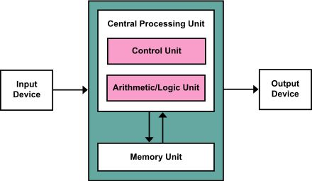
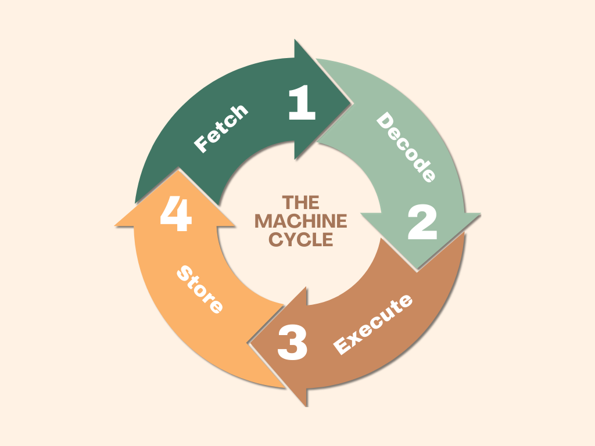
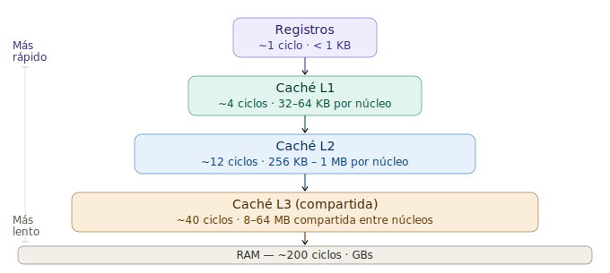
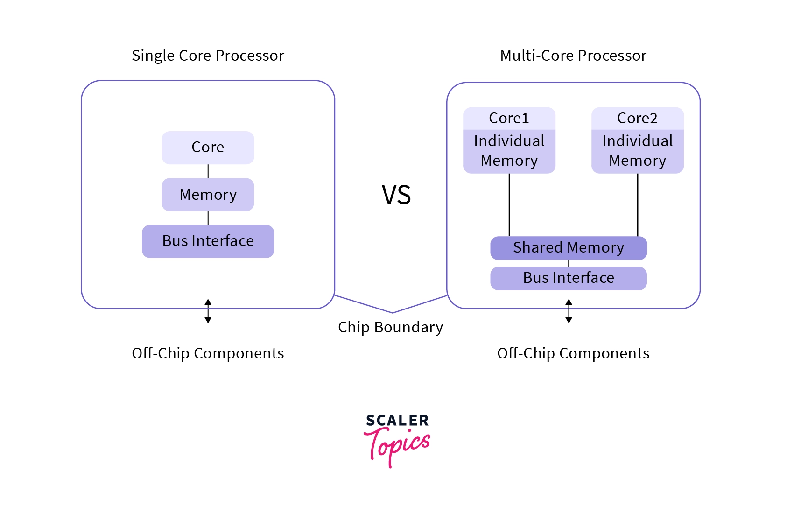

## Índice

1. [Modelo mental de ejecución](#modelo-mental-de-ejecución)

2. [Ciclo de instrucción](#ciclo-de-instrucción)

3. [Registros y ALU](#registros-y-alu)

4. [Caché](#caché)

5. [Pipelines](#pipelines)

6. [Multicore y paralelismo](#multicore-y-paralelismo)

7. [Quiz basico sobre CPU](#quiz-basico-sobre-cpu)

8. [Solucion Quiz](#solucion-quiz)

9. [CPU | Instrucciones De CPU (ASM, Opcode & RAM)](#cpu--instrucciones-de-cpu-asm-opcode--ram)

10. [Kernel/Supervisor mode and User mode](#kernelsupervisor-mode-and-user-mode)

11. [Referencias](#referencias)


# 1. Fundamentos Basicos (Resumido)

La CPU (Unidad Central de Procesamiento) es el componente encargado de ejecutar instrucciones y procesar datos. No "piensa" ni "entiende" programas; simplemente sigue órdenes muy básicas definidas en binario.

A nivel físico, no es un bloque monolítico, sino un conjunto de subsistemas especializados que trabajan coordinadamente.

---

## 1.1 Modelo mental de ejecución

Antes de entrar en detalles internos, necesitas una idea clara de cómo funciona todo el sistema:

- Un **programa** es una secuencia de instrucciones almacenadas en memoria.

- La **memoria RAM** es básicamente un array de bytes direccionables.

- La **CPU** es un ejecutor secuencial que:
  1. Lee una instrucción desde memoria
  2. La interpreta
  3. La ejecuta

Ejemplo simplificado en pseudocódigo:

```c
while (true) {
    instruccion = memoria[PC];
    ejecutar(instruccion);
    PC++;
}
```



EL PC (Program Counter) apunta siempre a la siguiente instrucción a ejecutar. Este modelo es solo una simplificación para entender todo lo que viene después.

Con esto dicho, tendras algunas preguntas, en mi caso me preguntaba ¿porque esto no es mas simple?

En la practica, el modelo tiene problemas importantes.

- La CPU es extremadamente rápida

- La RAM es relativamente lenta

- Las instrucciones pueden depender unas de otras

- Hay múltiples programas compitiendo por CPU

Para resolver estos problemas existen:

- Caché

- Pipeline

- Ejecución fuera de orden

- Sistema Operativo

Todo lo que verás a continuación existe para optimizar este modelo basico de CPU que hemos visto antes.


## 2. Ciclo de instrucción

Todo lo que hace la CPU se reduce a repetir constantemente un ciclo conocido como:

**fetch → decode → execute**

Este ciclo es la implementación real del modelo visto anteriormente.



<br>

### 2.1 Fetch (búsqueda)

La CPU obtiene la siguiente instrucción desde memoria:

1. El **PC (Program Counter)** contiene la dirección de la próxima instrucción.

2. Esa dirección se envía a memoria.

3. La instrucción se carga en el **IR (Instruction Register)**.

```text

PC → Memoria → IR

```

Despues de esto, el PC normalmente se incrementa para apuntar a la siguiente instrucción.

### 2.2 Decode (decodificación)

La Unidad de Control (CU) interpreta la instrucción:

- Qué operación realizar (ADD, MOV, JMP, etc.)

- Qué operandos usar

- Qué unidades internas activar (ALU, memoria, registros)

Aquí la CPU traduce binario a señales de control internas.

### 2.3 Execute (ejecución)

Se realiza la operación:

- Operaciones aritméticas → ALU

- Acceso a memoria → lectura/escritura

- Control de flujo → saltos (JMP, CALL, etc.)

Nota: Usualmente la CPU requiere llamar valores almacenados previamentes, en esos momentos es cuando entran operaciones del control de flujos como (JMP, CALL, etc).

### 2.4 Ejemplo práctico

Supongamos la instrucción:

```text

ADD AX, BX

```

Flujo simplificado:

Fetch: 

- se carga ```ADD AX, BX``` en el IR

Decode: 

la CU identifica:

- Operación: suma

- Operandos: AX y BX

Execute:

- La ALU suma AX + BX

- El resultado se guarda en AX

## 3. Registros y ALU

La CPU no opera directamente sobre la memoria RAM en la mayoria de los casos. En su lugar, utiliza **registros internos**, que son pequeñas unidades de almacenamiento extremadamente rápidas dentro del propio procesador.

### 3.1 Registros

Los registros son celdas de memoria de muy baja latencia (Nanosegundos o menos), tipicamente del tamaño de la arquitectura. Por ejemplo: 64 bits en sistemas modernos.

Se utilizan para:

- Almacenar datos temporales
- Guardar direcciones de memoria
- Controlar la ejecución del programa

Acceder a un registro es **mucho más rápido** que acceder a RAM.

### 3.2 Tipos de registros

Registros de control

Controlan el flujo de ejecución:

- **PC (Program Counter)**: dirección de la siguiente instrucción
- **IR (Instruction Register)**: instrucción actual

Registros de memoria

Intermediarios entre CPU y RAM:

- **MAR (Memory Address Register)**: dirección a acceder
- **MDR (Memory Data Register)**: dato leído o a escribir

Registros de proposito general

Usados directamente por las instrucciones:

- AX, BX, CX, DX (x86)

- RAX, RBX, RCX, etc. Estos son mas usados en arquitecturas modernas


### 3.3 ALU (Arithmetic Logic Unit)

La **ALU** es la unidad encargada de ejecutar operaciones básicas:

- Aritméticas: suma, resta, multiplicación
- Lógicas: AND, OR, XOR, NOT
- Comparaciones

Ejemplo:

```

ADD RAX, RBX

```

Flujo:

Se cargan los valores de RAX y RBX en la ALU
La ALU realiza la suma
El resultado se escribe en RAX


### 3.4 FPU (Floating Point Unit)

La FPU es una unidad especializada para operaciones con números en punto flotante:

- float (32 bits)

- double (64 bits)

Históricamente era un coprocesador separado (ej: [Intel 80387](https://www.dosdays.co.uk/topics/math_coprocessors.php))

### 3.5 Idea simple para comprender la CPU

Esta idea es clave para comprender la CPU, intenta asimilar la siguiente frase.

**La CPU está diseñada para operar sobre registros, no sobre la RAM**

Enlaces de Referencias - Registers, FPU & LU

- [Registers](https://clearinfosec.com/cpus-and-registers/)

- [Processor Register](https://en.wikipedia.org/wiki/Processor_register)

- [Logic Unit](https://en.wikipedia.org/wiki/Arithmetic_logic_unit)

- [Floating Point Unit](https://en.wikipedia.org/wiki/Floating-point_unit)

## 4. Caché

La caché es una memoria pequeña y muy rapida que almacena copias de datos frecuentemente utilizados.

Niveles típicos:

- **L1**: muy pequeña, extremadamente rápida (por núcleo)

- **L2**: más grande, algo más lenta

- **L3**: compartida entre núcleos, más grande pero más lenta

Flujo de interacción CPU

```text

CPU → L1 → L2 → L3 → RAM

```

En la siguiente imagen se expresa de una mejor manera.



!!! note

    Si el dato no se encuentra en un nivel se llama cache miss y tiene una penalización para la CPU.


### 4.1 Cache hit vs Cache Miss

- Cache hit: el dato está en caché - Acceso rápido.

- Cache miss: El dato no está - Acceso lento (penalización, mas tiempo en realizar una ejecución).

Un miss puede costar cientos de ciclos, afectando directamente al rendimiento.

La caché funciona gracias a un principio clave:

- **Localidad de referencia** : Los programas tienden a acceder a la memoria de forma predecible.

- **Localidad temporal** : Si accedes a un dato, es probable que lo vuelvas a usar pronto.

Cache lines

La caché no carga bytes individuales, sino bloques llamados cache lines (tipicamente de 64 bytes).

Esto optimiza la localidad espacial.

Ejemplo:

- Accedes array[0]

- Se carga un bloque completo (ej: array[0] a array[30])


### 4.2 Idea clave para entender Caché

**La CPU no es lenta; lo que es lento es acceder a la memoria, la caché existe para ocultar esa latencia**.

Referencias a Cache

- [Cache Miss](https://kerneldigest.dev/glosario/hardware/cache-miss/)

- [Cache Concepto e Historia](https://es.wikipedia.org/wiki/Cach%C3%A9_(inform%C3%A1tica))

## 5. Pipelines

El modelo fetch → decode → execute sugiere ejecución secuencial.  

Sin embargo, las CPUs modernas ejecutan múltiples instrucciones simultáneamente mediante **pipeline**.

---

### 5.1 Concepto sobre los Pipelines 

El pipeline divide la ejecución de una instrucción en etapas, permitiendo que varias instrucciones estén en distintas fases al mismo tiempo.


Ejemplo de pipeline RISC de 5 etapas:

```bash

Ciclo:    1    2    3    4    5    6    7
Inst 1:  [IF] [ID] [EX] [MEM] [WB]
Inst 2:       [IF] [ID] [EX] [MEM] [WB]
Inst 3:            [IF] [ID] [EX] [MEM] [WB]

```

Donde:
- IF: Fetch
- ID: Decode
- EX: Execute
- MEM: Memory Access
- WB: Write Back

### 5.2 Beneficios Claves

Sin pipeline:

- 1 instrucción tarda N ciclos.

Con pipeline:

- Se completa 1 instrucción por ciclo (idealmente, pueden haber excepciones).

Sin embargo esto incrementa el throughout, no la latencia invidual.

### 5.3 Hazards

El pipeline introduce conflictos llamados hazards.

Data hazards (Dependencias de datos)

Ocurren cuando una instrucción depende del 
resultado de otra:

```

ADD RAX, RBX
SUB RCX, RAX

```

La segunda instrucción necesita el resultado de la primera (RAX).

Solución.

- Stalls (espera)

- Forwarding (Bypass de datos)

Control hazards (saltos)

Ocurren en instrucciones de salto:

```

JMP tag

```

La CPU no sabe que instrucción ejecutar después hasta resolver la condición.

### 5.4 Branch prediction

Para evitar detener el pipeline, la CPU predice el resultado de saltos.

- Si acierta: ejecución continua

- Si falla: pipeline flush (penalización)

Las CPUs modernas usan algoritmos sofisticados basados en historial.

### 5.5 Ejecucion fuera de orden (Out-of-order execution)

Las CPUs modernas no ejecutan instrucciones estrictamente en orden.

Ejemplo.

```

1. ADD RAX, RBX

2. MUL RCX, RDX

```

Si la instrucción 1 esta bloqueada (esperando datos), la CPU puede ejecutar la 2 primero.

Esto mejora el uso de recursos internos.


### 5.6 Ejecución especulativa

La CPU puede ejecutar instrucciones antes de saber si realmente se necesitan.

Ejemplo:

- Predice un salto

- Ejecuta instrucciones siguientes

- Si la predicción falla - descarta resultados.

Esto mejora rendimiento, pero introduce problemas de seguridad (Spectre, MeltDown, etc).

### 5.7 Idea clave para entender Pipelines

Las CPUs modernas no ejecutan instrucciones de forma estrictamente secuencial.

En realidad

- Reordenan.

- Predicen.

- Ejecutan en paralelo.


Referencias pipelines

- [Pipelines](https://carteleras.webcindario.com/6-Pipeline.pdf)

- [Stony Brook University](https://compas.cs.stonybrook.edu/~nhonarmand/courses/sp15/cse502/slides/05-pipelining.pdf)

## 6. Multicore y paralelismo



<br>

Hasta ahora hemos asumido a una CPU ejecutando instrucciones de manera secuencial y otras veces usando branch-prediction, pipelines etc.

En la práctica, las CPUs modernas tienen múltiples **núcleos** (cores), lo que permite ejecutar múltiples flujos de instrucciones en paralelo.

---

### 6.1 ¿Qué es un núcleo?

Un **núcleo** es esencialmente una CPU completa e independiente dentro del mismo chip:

- Tiene su propio pipeline

- Tiene sus propios registros

- Puede ejecutar instrucciones de forma autónoma

Un procesador de 4 núcleos puede ejecutar 4 instrucciones (o más) en paralelo.

---

### 6.2 Paralelismo vs concurrencia

Es importante no confundir estos conceptos:

- **Paralelismo**: múltiples instrucciones ejecutándose físicamente al mismo tiempo (múltiples núcleos)

- **Concurrencia**: múltiples tareas progresando intercaladamente (aunque haya un solo núcleo)

Ejemplo:

- 1 núcleo → concurrencia

- N núcleos → paralelismo real

---

### 6.3 Hilos (threads)

Un **hilo** es una unidad de ejecución dentro de un proceso.

- Cada hilo tiene su propio estado (registros, stack)

- Comparte memoria con otros hilos del mismo proceso

El sistema operativo asigna hilos a núcleos.

---

### 6.4 SMT / Hyperthreading

SMT (Simultaneous Multithreading), conocido comercialmente como **Hyperthreading**, permite que un núcleo ejecute múltiples hilos de forma simultánea.

Importante:

> No duplica el núcleo físico

Lo que hace es:

- Compartir recursos del núcleo

- Aprovechar ciclos ociosos

Ejemplo:

- Un núcleo con SMT puede manejar 2 hilos

- Pero el rendimiento no es 2x (típicamente 20–40% extra)

---

### 6.5 ¿Por qué existe SMT?

Dentro de un núcleo hay unidades que no siempre están ocupadas:

- ALU
- Unidades de carga/almacenamiento
- Pipeline parcialmente vacío

SMT permite que otro hilo use esos recursos en paralelo.

---

### 6.6 Escalabilidad real

Más núcleos ≠ más rendimiento automáticamente.

Limitaciones:

- Código secuencial (Ley de Amdahl)

- Contención de memoria

- Sincronización entre hilos

Ejemplo:

```

Si el 50% de un programa es secuencial,
el speedup máximo es limitado aunque aumentes núcleos.

```

## 7. Interrupciones

Hasta ahora hemos visto la CPU ejecutando instrucciones de forma continua.  
Sin embargo, en un sistema real, la CPU necesita reaccionar a eventos externos e internos.

Para esto existen las **interrupciones**.

---

### 7.1 ¿Qué es una interrupción?

Una **interrupción** es una señal que detiene temporalmente la ejecución normal de la CPU para atender un evento.

Ejemplos:

- Pulsar una tecla

- Llegada de un paquete de red

- Finalización de una operación de disco


### 7.2 Flujo de una interrupción

Cuando ocurre una interrupción, la CPU realiza:

1. Finaliza la instrucción actual

2. Guarda el estado actual (registros, PC, flags)

3. Salta a una rutina especial llamada **ISR (Interrupt Service Routine)**

4. Ejecuta la [ISR](https://wiki.osdev.org/Interrupt_Service_Routines)

5. Restaura el estado previo

6. Continúa la ejecución original

```

Programa → [INTERRUPCION] → ISR → retorno → Programa

```

!!! note

    La ISR es una funcionalidad es una pieza especial de software que se ejecuta automaticamente por un microcontrolador en respuesta a un evento de la CPU o el Hardware, Pausa el programa principal mientras se atienden los eventos y luego lo reanuda, esto evita el bloequeo o la corrución de los programas.

!!! note

    Un ejemplo de interrupción de hardware es el teclado: cada vez que se pulsa una tecla, el teclado activa la IRQ1 (Solicitud de Interrupción 1) y se llama al controlador de interrupción correspondiente. Los temporizadores y la finalización de las solicitudes de disco son otras posibles fuentes de interrupciones de hardware.


No hay un mejor lugar donde definan cada paso y especificaciones del ISR que en OSDev.org - Puedes chequearlo [aqui](https://wiki.osdev.org/Interrupt_Service_Routines)


### 7.3 Interrupt Vector Table (IVT)

La CPU necesita saber qué ISR ejecutar según la interrupción.

Para ello existe una tabla:

Interrupt Vector Table (IVT) o IDT en sistemas modernos
Asocia cada interrupción con una dirección de memoria (handler)

Ejemplo conceptual:

```

Interrupt 0 → dirección X

Interrupt 1 → dirección Y

Interrupt N → dirección Z

```

### 7.4 Tipos de interrupciones

Interrupciones de hardware

Provienen de dispositivos externos:


- Teclado

- Tarjeta de red

- Disco

Son asíncronas respecto al flujo del programa.

**Interrupciones de software**

Generadas por instrucciones del propio programa:

```

INT 0x80

```

Se usan para interactuar con el sistema operativo (ej: syscalls en sistemas antiguos).

**Excepciones (internas)**

Eventos generados por la propia CPU:

- División por cero

- Fallo de página (page fault)

- Instrucción inválida

### 7.5 Controlador de interrupciones

El hardware usa controladores como:

- APIC (Advanced Programmable Interrupt Controller)

- IOAPIC

Estos controladores tienen las siguientes funciones:

- Gestionar múltiples interrupciones

- Priorizar eventos

- Asignar interrupciones a núcleos específicos

### 7.6 Idea clave para entender sobre interrupciones

Muchos podrian pensar que la CPU tiene un bucle infinito donde esta constantemente analizando eventos externos para levantar un interrupt, pero esto es ineficiente.

```c

while (true) {
    if (teclado_tiene_datos()) {
        leer();
    }
}

```

Al contrario de esto la CPU solo es interrumpida cuando un dispositivo notifica a la CPU que tiene datos.

Las interrupciones permiten a la CPU reaccionar a eventos sin perder tiempo consultando constantemente.


## Quiz basico sobre CPU

1 **Concepto básico**

¿Qué es exactamente la CPU?

A) Un dispositivo de almacenamiento

B) El cerebro que ejecuta instrucciones y procesa datos'

C) Un tipo de memoria RAM

D) Un controlador de periféricos

<br>

2 **Componentes internos**

¿Cuál de los siguientes NO es un componente típico de la CPU?

A) Unidad de control

B) Registros

C) Disco duro

D) ALU

<br>

3 **ALU**

¿Qué hace la ALU?

A) Controla el flujo de datos

B) Gestiona memoria virtual

C) Ejecuta operaciones aritméticas y lógicas

D) Controla dispositivos de entrada

<br>

4 **Ciclo de instrucción**

¿Cuál es el orden correcto?

A) Execute → Fetch → Decode

B) Fetch → Decode → Execute

C) Decode → Execute → Fetch

D) Fetch → Execute → Decode

<br>

5 **Frecuencia**

La frecuencia de una CPU (GHz) indica:

A) Cantidad de núcleos

B) Tamaño de la caché

C) Consumo energético

D) Velocidad de ejecución de ciclos por segundo

<br>

6 **Multicore**

¿Qué ventaja principal tienen múltiples núcleos?

A) Mayor capacidad de almacenamiento

B) Ejecutar múltiples tareas en paralelo

C) Reducir el tamaño físico del chip

D) Aumentar la velocidad de red

<br>

7 **Caché**

¿Cuál es el propósito de la memoria caché?

A) Acelerar acceso a datos frecuentes

B) Guardar archivos del usuario

C) Sustituir la RAM

D) Almacenar el sistema operativo completo

<br>

8 **Tipos de caché**

¿Cuál suele ser más rápida?

A) L1

B) L3

C) L2

D) Todas iguales

<br>

9 **Hyperthreading / SMT**

¿Qué hace el hyperthreading?

A) Permite que un núcleo ejecute múltiples hilos

B) Reduce el consumo energético

C) Aumenta la frecuencia automáticamente

D) Duplica los núcleos físicos

<br>

10 **Bottleneck**

Si la CPU está al 100% pero la GPU al 40%, ¿qué ocurre?

A) Problema de RAM

B) Bottleneck en GPU

C) No hay problema

D) Bottleneck en CPU

## Solucion Quiz

```bash

1. b
2. c
3. c
4. b
5. d
6. b
7. a
8. a
9. a
10. d

```


## Quiz sobre CPU (Medio)

### 1. Modelo de ejecución

¿Qué representa realmente el Program Counter (PC)?

A) El resultado de la última operación 

B) La dirección de la siguiente instrucción  

C) El registro de datos principal  

D) El estado del sistema operativo  

<br>

### 2. Ciclo de instrucción

¿Qué ocurre durante la fase de decode?

A) Se ejecuta la operación en la ALU  

B) Se obtiene la instrucción desde RAM  

C) Se interpreta la instrucción y se generan señales de control  

D) Se escribe el resultado en memoria  

<br>

### 3. Registros

¿Por qué la CPU usa registros en lugar de operar directamente sobre RAM?

A) Porque la RAM es más grande  

B) Porque los registros son más rápidos  

C) Porque la RAM no puede almacenar enteros  

D) Porque la ALU no soporta RAM  

<br>

### 4. ALU

¿Cuál de las siguientes operaciones NO realiza típicamente la ALU?

A) Suma  

B) Comparación  

C) Acceso a disco  

D) Operaciones lógicas  

<br>

### 5. Caché

¿Qué causa un **cache miss**?

A) La CPU ejecuta una instrucción inválida  

B) El dato no se encuentra en el nivel de caché actual  

C) El pipeline se detiene  

D) La RAM falla  

<br>

### 6. Localidad

La **localidad espacial** implica:

A) Reutilizar el mismo dato repetidamente  

B) Acceder a direcciones de memoria cercanas  

C) Ejecutar múltiples hilos  

D) Reducir el tamaño de caché  

<br>

### 7. Pipeline

¿Cuál es el principal beneficio del pipeline?

A) Reduce el tamaño de la CPU  

B) Reduce el consumo energético  

C) Aumenta el throughput de instrucciones  

D) Elimina dependencias  

<br>

### 8. Hazards

¿Qué tipo de hazard ocurre en este caso?

```asm

ADD RAX, RBX
SUB RCX, RAX

```

A) Control hazard

B) Structural hazard

C) Data hazard

D) Cache hazard

<br>

**9 Branch prediction**

¿Qué ocurre cuando la predicción de salto falla?

A) Se reinicia la CPU

B) Se ignora la instrucción

C) Se vacía el pipeline (flush)

D) Se detiene el sistema operativo

<br>

**10 Out-of-order execution**

¿Cuál es el objetivo principal?

A) Ejecutar instrucciones más lentamente

B) Mantener el orden exacto del programa

C) Aprovechar mejor los recursos de la CPU

D) Reducir el tamaño del código

<br>

**11 Multicore**

¿Qué define el paralelismo real?

A) Ejecutar tareas en diferentes momentos

B) Ejecutar múltiples instrucciones simultáneamente en distintos núcleos

C) Cambiar rápidamente entre tareas

D) Reducir el uso de memoria

<br>

**12 SMT / Hyperthreading**

¿Qué hace realmente SMT?

A) Duplica núcleos físicos

B) Duplica la memoria RAM

C) Permite que un núcleo ejecute múltiples hilos compartiendo recursos

D) Aumenta la frecuencia del CPU

<br>

**13 Interrupciones**

¿Qué ocurre primero cuando llega una interrupción?

A) Se ejecuta la ISR inmediatamente

B) Se guarda el estado actual de la CPU

C) Se reinicia el programa

D) Se limpia la caché

<br>

**14 ISR**

¿Qué es una ISR?

A) Un registro interno

B) Una rutina que maneja una interrupción

C) Un tipo de caché

D) Un hilo del sistema operativo

<br>

**15 Polling vs interrupciones**

¿Por qué las interrupciones son más eficientes que polling?

A) Usan más CPU

B) Evitan consultas constantes innecesarias

C) Eliminan la RAM

D) Reducen el número de instrucciones

```
1. b
2. c
3. b
4. c
5. b
6. b
7. c
8. c
9. c
10. c
11. b
12. c
13. b
14. b
15. b
```

## Referencias

- [CPU.Land](https://cpu.land/the-basics)

- [Lenovo CPU](https://www.lenovo.com/us/en/glossary/how-does-a-cpu-work/)

- [OSDev org](https://wiki.osdev.org/)