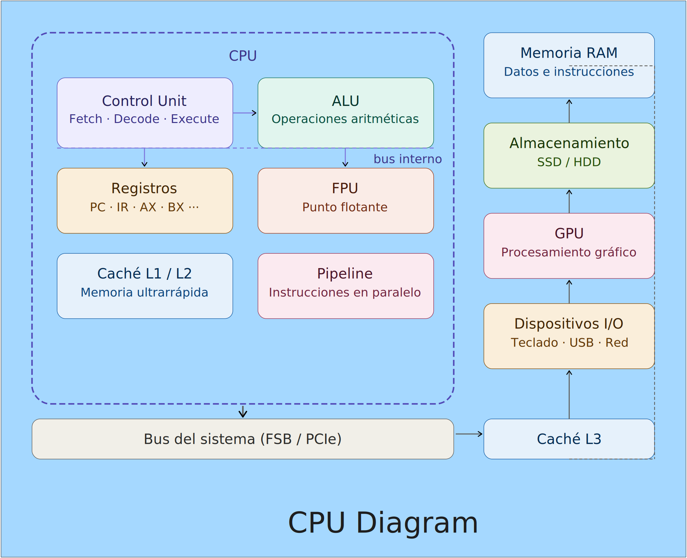

# CPU, Entendiendo como trabaja (Resumido).

La CPU (Unidad Central de Procesamiento) no es un bloque monolítico, sino un sistema con subsistemas que se comunican constantemente.

## 1. Ciclo de instrucción

Todo lo que hace una CPU se reduce a repetir un ciclo llamado fetch-decode-execute.

- **Fetch**: la CU lee la siguiente instrucción desde la memoria RAM usando el Program Counter (PC), un registro que apunta a la dirección actual. La instrucción viaja por el bus de datos hasta el Instruction Register (IR).
- **Decode**: la CU interpreta el código binario y determina qué operación ejecutar y con qué operandos.
- **Execute**: la CU activa los elementos necesarios: suma (ALU), acceso a memoria, actualización de registros.

## 2. ALU y registros

La ALU (Arithmetic Logic Unit) ejecuta operaciones aritméticas y lógicas. En la mayoría de la arquitectura no opera sobre RAM directamente; opera sobre registros internos, pequeñas celdas de 64 bits dentro de la CPU.

Componentes relevantes:

- PC (Program Counter): dirección de la siguiente instrucción.
- IR (Instruction Register): instrucción actual.
- MAR (Memory Address Register): dirección de memoria a leer/escribir.
- MDR (Memory Data Register): dato transferido desde/hacia RAM.

Registros de propósito general: AX, BX, CX, etc.

La FPU (Floating Point Unit) es la unidad para operaciones de punto flotante (float, double). Antes era un co-procesador separado (ej. 80387), hoy está integrado en el mismo chip de CPU.

## 3. Jerarquía de caché y velocidad

La RAM es varias órdenes de magnitud más lenta que la CPU. La caché actúa como un buffer ultrarrápido.

La CPU busca datos primero en L1. Si hay cache miss, busca en L2, luego L3 y, si no está, en RAM. La penalización por miss puede costar cientos de ciclos. Compiladores y SO modernos buscan maximizar cache hits.

## 4. Pipeline y paralelismo interno

Sin pipeline, cada instrucción se completa antes de iniciar la siguiente. Con pipeline, las etapas se superponen, lo que mejora rendimiento.

Ejemplo de pipeline RISC de 5 etapas:

Ciclo:    1    2    3    4    5    6    7
Inst 1:  [IF] [ID] [EX] [ME] [WB]
Inst 2:       [IF] [ID] [EX] [ME] [WB]
Inst 3:            [IF] [ID] [EX] [ME] [WB]

Donde:
- IF: Fetch
- ID: Decode
- EX: Execute
- ME: Memory Access
- WB: Write Back

Los hazards (dependencias entre instrucciones) pueden generar stalls. Las CPU modernas usan predicción de saltos y ejecución fuera de orden para mitigarlos.

## 5. Comunicación con RAM: bus y controlador

La CPU no accede a RAM directamente. El proceso típico:

1. La CPU coloca la dirección en MAR.
2. El bus de direcciones lleva la dirección al controlador de memoria (integrado en CPU / antiguo Northbridge).
3. El controlador accede a RAM y devuelve el dato en MDR.
4. La CU copia el dato al registro destino.

El ancho del bus (64 bits moderno) y la velocidad (MHz/GHz) determinan el ancho de banda, un cuello de botella crítico.

## 6. Buses y dispositivos externos

Dispositivos externos se conectan mediante buses:

- PCIe: GPU, NVMe.
- SATA/NVMe: almacenamiento.
- USB: periféricos.
- APIC/IOAPIC: interrupciones.

Las interrupciones interrumpen la ejecución para ejecutar ISRs (Interrupt Service Routines) y luego se reanuda.

## 7. SO: intermediario

El sistema operativo administra acceso y recursos:

- Scheduler: decide qué proceso ejecuta y cuándo (Round Robin, CFS, etc.).
- MMU: traduce direcciones virtuales a físicas y protege memoria.
- DMA (Direct Memory Access): permite a dispositivos leer/escribir RAM sin CPU en cada transferencia.

## Resumen

La CPU es el director de orquesta; registros y ALU son músicos, caché es el atril, la RAM es el archivo y el bus es el pasillo. La CU coordina todo ciclo a ciclo, miles de millones de veces por segundo.

## Referencias

https://cpu.land/the-basics

https://www.lenovo.com/us/en/glossary/how-does-a-cpu-work/