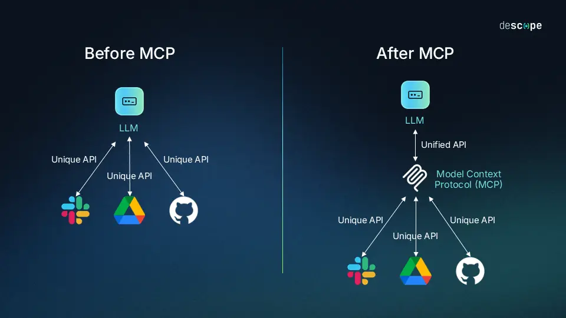
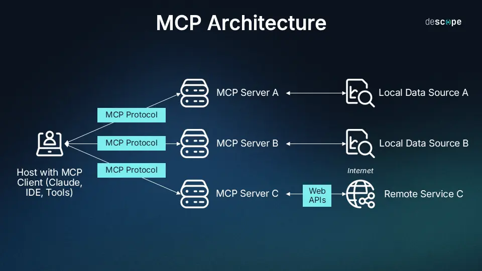
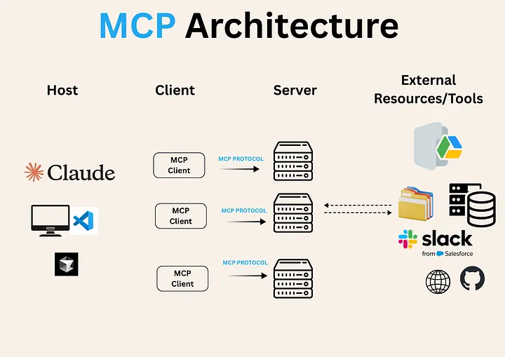
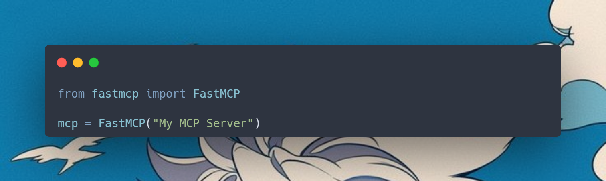
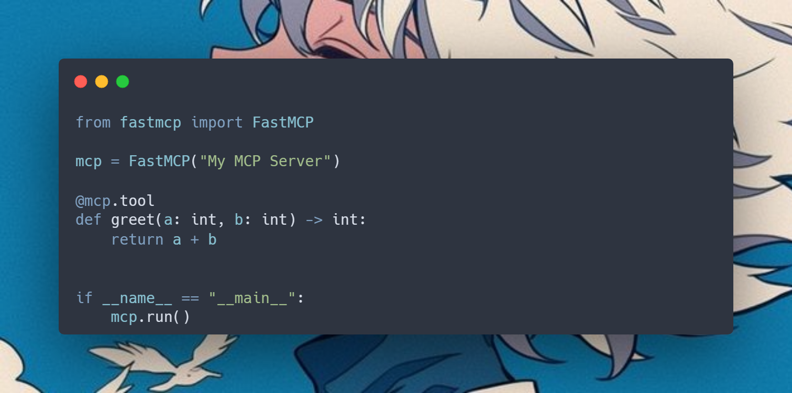
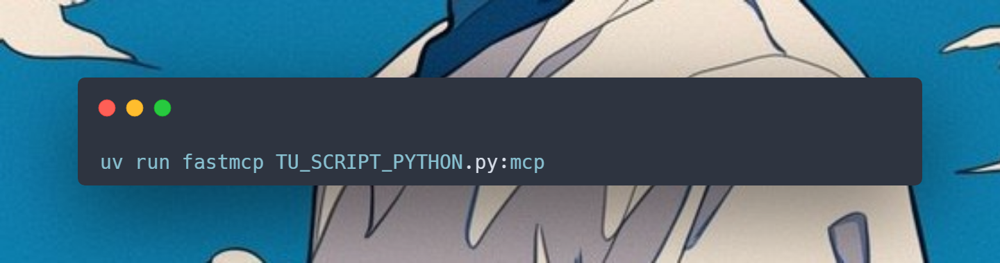

# MCP: Una Guía en Español para Comprender el Protocolo MCP

## ¿Qué es un MCP (Model Context Protocol)?

Se trata de un **estándar de código abierto** para conectar aplicaciones de AI/LLM a sistemas externos o internos, dependen del contexto.

Aplicaciones de AI como **ChatGPT** o **Claude** permiten conectar fuentes de datos externas (ejemplo: archivos, bases de datos) y flujos de trabajo (ejemplo: prompts) y habilitarlos para realizar una tarea en específico.

Piensa en el **MCP** como un puerto **USB-C** para aplicaciones de AI. Un USB-C provee una forma estándar de conectar dispositivos electrónicos; algo similar hace el MCP, provee un estándar para conectar aplicaciones externas a la AI.



Fuente: [descope.com](https://www.descope.com/learn/post/mcp)


Fuente: [ModelContextProtocol.io](https://modelcontextprotocol.io/docs/getting-started/intro)

Como habrás visto en imágenes anteriores, el **MCP** sería algo muy parecido a una **API** pero mucho más complejo por distintas razones. Antes del MCP, las aplicaciones de AI debían entender previamente las API de cada aplicación externa a la que fueran conectadas, lo cual se volvía muy caótico.

!!! note

    El **Model Context Protocol (MCP)** fue creado y lanzado por **Anthropic** en noviembre de 2024. Los ingenieros clave en este proyecto fueron **David Soria Parra** y **Justin Spahr-Summer**.

## Casos de Uso

- Puedes conectar agentes a carteras digitales y hacer que hagan apuestas en línea. Yo hice algo parecido con **openclaw** [Puedes chequearlo aquí](https://eirikrrrr.github.io/blog/2025/02/18/bot-de-apuestas-del-clima---openclaw-simmer-market--polymarket/).

- Podrías conectar un agente de AI a **Slack** y que analice tus conversaciones o responda por ti.

- Los agentes de AI pueden acceder a tu **Notion** o **Calendario** y actuar como un asistente personal.

- **Claude** puede generar aplicaciones web enteras usando un diseño de **Figma**.

- Los chatbots pueden conectarse a múltiples bases de datos a través de múltiples organizaciones y analizar los datos usando únicamente el chat.


## Servidores, Cliente y Transporte

**MCP**, al igual que **HTTP** y muchos otros protocolos, sigue el modelo cliente-servidor. El cliente es el LLM (Chat UI-Web), y el servidor expone herramientas al LLM.
El cliente y el servidor se comunican a través de un transporte, que puede ser totalmente local o a través de Internet.

- **Servidores**: Exponen herramientas al cliente.

- **Clientes**: Pueden llamar las herramientas del servidor.

- **Transporte**: Es cómo el cliente y el servidor se comunican. Esto puede ser local (STDIO), sobre Internet (HTTP) o incluso sobre alguna capa de transporte personalizada. 


## ¿Cuál es la Importancia de MCP?

MCP puede ofrecer un amplio rango de beneficios:

- **Desarrolladores**: MCP reduce el tiempo de desarrollo y la complejidad al momento de construir e integrar alguna aplicación de AI o agente.

- **AI & Agentes**: MCP provee acceso a un ecosistema de datos, herramientas y aplicaciones las cuales mejoran las capacidades y experiencias del usuario final.

- **Usuario Final**: Los agentes pueden acceder a tus datos y tomar acción sobre ellos cuando sea necesario.


## Arquitectura

**Alcance (Scope)**

El proyecto MCP expone algunos artículos técnicos y profundos en los cuales detalla los pasos para la implementación de los servidores MCP:

- **MCP Specification**: Especificaciones para la implementación y los requerimientos para clientes y servidores.

- **MCP SDKs**: Kits para diferentes lenguajes de programación y su implementación con MCP.

- **MCP Development Tools Inspector**: Herramientas para el desarrollo de servidores MCP, se incluye el MCP Inspector.

- **MCP Reference Server Implementations**: Referencias para la implementación de MCP Servers.

En la siguiente imagen verás una tipica implementacion de uno o varios servidores MCP.




Fuente: [descope.com](https://www.descope.com/learn/post/mcp)



Fuente: [medium.com/aimonks](https://medium.com/aimonks/mcp-architecture-all-you-need-2cafe6c7d803)

La arquitectura consiste de los siguientes elementos:

- **MCP Host**: Programas como IDEs, Cursor, Claude Desktop, o herramientas de AI que quieren acceder a los datos a través de MCP.

- **MCP Client**: Protocolo cliente que mantiene una conexión 1:1 con el servidor MCP.

- **MCP Server**: Programas ligeros y específicos que exponen capacidades al MCP.

- **Local Data Sources**: Archivos, bases de datos o servicios a los cuales el MCP puede acceder o conectarse.


## Instalación de un MCP Server

Para este ejemplo usaremos una herramienta muy popular en la comunidad de Python: FastMCP.

**Primero, crea una carpeta para la prueba**

```bash

mkdir mcp-test && cd mcp-test

uv init .

```

**Instala las dependencias**

```bash

# Si usas PIP
pip install fastmcp

# Si usas UV
uv add fastmcp

```  

**Verifica la instalación**

```bash

fastmcp version        # Si usas solamente pip

uv run fastmcp version # Si usas UV

```

### Crea un FastMCP Server

Antes de continuar, te recuerdo que toda esta sección de instalación fue sacada de la documentación de [FastMCP](https://gofastmcp.com/getting-started/welcome). Por último, existen 3 pilares esenciales que un servidor MCP puede exponer:

- **Tools** > Acciones llamables, acciones que ejecutan funciones remotas.

- **Resources** > Endpoints de solo lectura, por ejemplo "data://users" o "data://products/product/[product_id]", le permite al cliente obtener data sin exponer una query.

- **Prompts** > Son templates reusables, el servidor puede usarlos para los clientes y mantener una consistencia en estilo, estructura o instrucciones. 


**Código**

Instanciamos la clase FastMCP y le damos un título o nombre al servidor.



Una vez instanciado, debemos otorgarle una herramienta que él pueda listar y ejecutar. En este caso, la primera herramienta es una función de suma; haremos que pueda sumar.



Ahora ejecuta en la consola el siguiente comando. Una vez ejecutado, debes abrir otra consola en el mismo directorio de trabajo donde estás.

<!-- ```bash

  uv run fastmcp TU_SCRIPT_PYTHON.py:mcp

``` -->



El comando de arriba ejecutará el script y abrirá un puerto TCP para recibir las peticiones HTTP. Estas peticiones idealmente las haría el LLM.

Crea otro script y escribe el siguiente código.
 
```python

import asyncio
from fastmcp import Client

client = Client("http://localhost:8000/mcp")

async def call_tool(name: str):
    async with client:
        result = await client.call_tool(name, {"a": 20, "b": 20})
        print(result)
        return result

asyncio.run(call_tool("add"))

```

Por último, ejecuta el nuevo script.

```bash

uv run mi_nuevo_script.py  # Con uv

# o 

python3 mi_nuevo_script.py # Con python

```

### Finalizado

Eso sería todo. Ya tienes un servidor MCP funcionando en un puerto que puede ejecutar operaciones de cualquier herramienta que le agregues. Cabe destacar que a FastMCP puedes agregarle el LLM de tu preferencia, también autenticación, prompts customizados y predefinidos, entre muchas otras cosas interesantes que trae este framework.

!!! note

    Muchos errores del MCP pueden suceder por errores de tipos (type hint), por ello es recomendable usar un linter.


